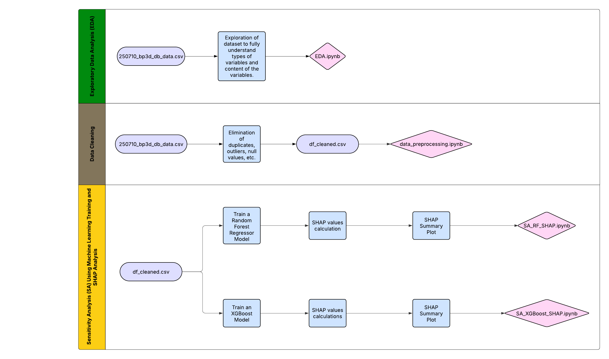

# ENLACE Summer Research Program 2025

## Workflows for Wildfire Management

**Authors:**  
Luis Angel Castaneda Barron (CETYS Universidad)  
Said Carbot Cruz Trejo (Instituto Politécnico Nacional)  
Grecia Paola Siono Gutierrez (UC San Diego)

---

## Explanation of Workflow

### 1. Exploratory Data Analysis (EDA)
- **Input:** `250710_bp3d_db_data.csv` (raw dataset generated from BurnPro3D’s database, e.g., July 10, 2025).  
  If needed, the path can be changed to a new dataset generated from BurnPro3D.
- **Process:**
  - Explore dataset variables, types, and contents.
  - Identify data distribution, potential issues, and important features.
- **Associated Notebook:** `EDA.ipynb` documents the exploratory analysis.

### 2. Data Cleaning
- **Input:** Same raw dataset (`250710_bp3d_db_data.csv`).  
- **Process:**
  - Remove duplicates, outliers, and null values.
  - Prepare a cleaned dataset for modeling.
- **Output:** `df_cleaned.csv` (cleaned dataset).  
- **Associated Notebook:** `data_preprocessing.ipynb` handles the data cleaning.

### 3. Sensitivity Analysis (SA) using Machine Learning and SHAP
- **Input:** `df_cleaned.csv` (cleaned dataset).  
- **Process:**
  1. **Model Training:**  
     - Train Random Forest Regressor and XGBoost model.
  2. **SHAP Analysis:**  
     - Compute SHAP (SHapley Additive exPlanations) values for both models to determine feature importance for three target variables:  
       *Surface consumed*, *Midstory consumed*, and *Canopy consumed*.  
     - Generate SHAP summary plots to visualize feature impact.
  3. **Important Notes:**  
     - Some additional data cleaning occurs in these notebooks.  
     - Final cleaning steps after discussions with Leticia and Pedro:  
       - Eliminated: `side_to_start_ignition`, `blackline_width`, `wind_height`, `firing_technique`, `dash_length`.  
       - Removed NaN values.

- **Associated Notebooks:**  
  - `SA_RF_SHAP.ipynb` for Random Forest SHAP analysis  
  - `SA_XGBoost_SHAP.ipynb` for XGBoost SHAP analysis  

The previously described workflow is visualized below:

